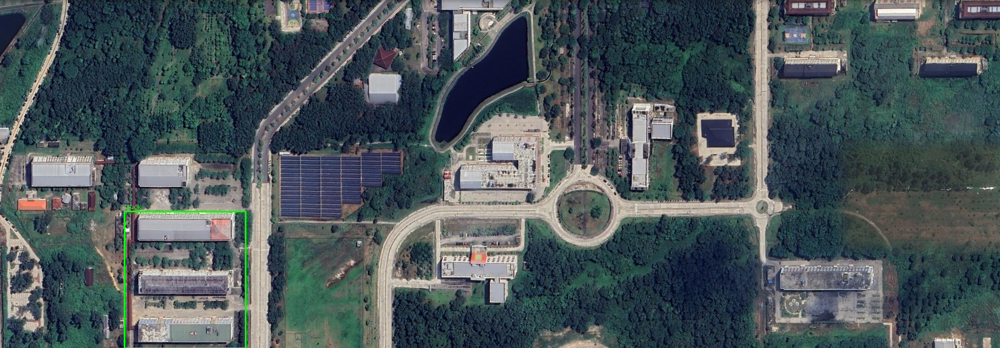
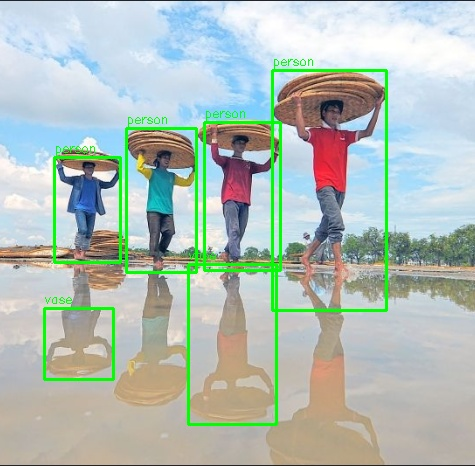
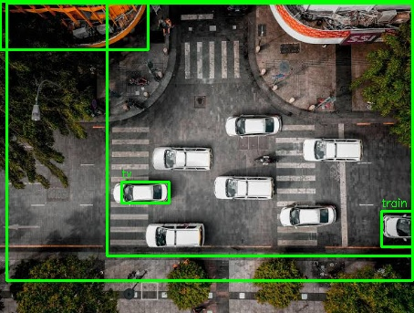
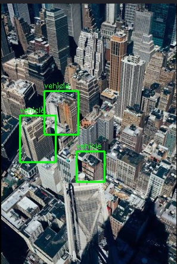
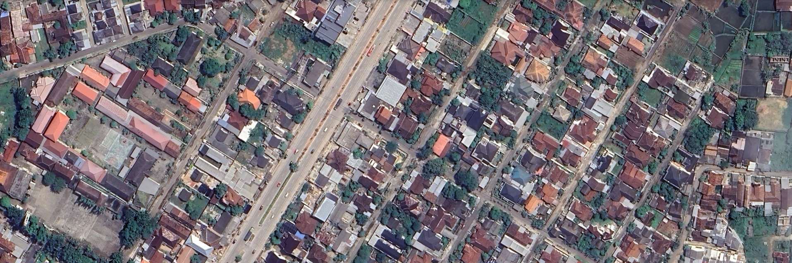
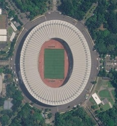

# Tugas 10 SIG - Spatial AI & Computer Vision Object Detection

Proyek ini merupakan implementasi **GeoAI (Geospatial Artificial Intelligence)** yang memanfaatkan model YOLOv8 dan OpenCV untuk mendeteksi objek fisik dari citra foto udara secara otomatis. Hasil deteksi berupa bounding box pada citra kemudian dikonversi menjadi data spasial berbentuk **GeoJSON** dengan koordinat geografis **EPSG:4326**.

## 👤 Identitas Mahasiswa
- **Nama**: Gohan Tua Jeremia Ambarita
- **NIM**: 123140160
- **Program Studi**: Teknik Informatika
- **Institusi**: Institut Teknologi Sumatera (ITERA)
- **Mata Kuliah**: Praktikum Sistem Informasi Geografis (SIG)

## 🚀 Tujuan Proyek
Proyek ini bertujuan untuk:
- mendeteksi objek pada citra satelit/foto udara,
- mengubah koordinat piksel menjadi koordinat geografis,
- mengekspor hasil deteksi ke format GeoJSON,
- serta memvisualisasikan hasil deteksi agar dapat dibuka di software GIS seperti QGIS.

## 🧠 Fitur Utama
1. **Deteksi objek otomatis** menggunakan model YOLOv8 (`yolov8n.pt`).
2. **Batch processing** untuk beberapa file gambar dalam folder `data`.
3. **Konversi koordinat piksel ke koordinat geografis** dengan pendekatan interpolasi linear.
4. **Ekspor hasil ke GeoJSON** untuk penggunaan di GIS.
5. **Visualisasi hasil deteksi** berupa file gambar `.jpg` pada folder `output`.

## 📊 Parameter Deteksi
| Parameter | Nilai | Fungsi |
|---|---:|---|
| `imgsz` | 640 | Menentukan ukuran pemrosesan internal model |
| `conf` | 0.15 | Batas kepercayaan agar objek kecil tetap terdeteksi |
| `Coordinate System` | EPSG:4326 | Koordinat geografis standar untuk GeoJSON |
| `Output Format` | GeoJSON | Format data spasial yang dapat dibuka di QGIS |

## 📁 Struktur Folder
- `data/` : berisi citra input yang akan dideteksi
- `output/` : berisi hasil deteksi berupa GeoJSON dan gambar visualisasi
- `spatial_ai.py` : script utama untuk deteksi dan eksekusi batch processing
- `visualisasi.py` : script untuk membuat plot visualisasi tambahan
- `requirements.txt` : daftar library yang dibutuhkan

## 🛠️ Cara Instalasi
1. Pastikan Python sudah terinstal di komputer.
2. Buka terminal atau PowerShell.
3. Masuk ke folder proyek:
   ```bash
   cd D:\prak_sig\Tugas 10
   ```
4. Install dependency:
   ```bash
   pip install -r requirements.txt
   ```

## ▶️ Cara Menjalankan
### 1. Jalankan deteksi objek
```bash
python spatial_ai.py
```
Script ini akan:
- mengunduh model `yolov8n.pt` bila belum ada,
- membaca semua gambar dari folder `data`,
- melakukan deteksi objek,
- menyimpan hasil ke folder `output`.

### 2. Jalankan visualisasi tambahan (opsional)
```bash
python visualisasi.py
```

## 📸 Hasil Deteksi
Berikut adalah hasil yang dihasilkan oleh program pada folder `output`:

| File Input | File Hasil Deteksi | File Visualisasi | Keterangan |
|---|---|---|---|
| `data/ITERA.png` | `output/deteksi_ITERA.geojson` | `output/hasil_ITERA.jpg` | Deteksi objek pada area ITERA |
| `data/manusia.png` | `output/deteksi_manusia.geojson` | `output/hasil_manusia.jpg` | Objek manusia/figur pada citra |
| `data/mobil.png` | `output/deteksi_mobil.geojson` | `output/hasil_mobil.jpg` | Deteksi kendaraan |
| `data/pencakar.png` | `output/deteksi_pencakar.geojson` | `output/hasil_pencakar.jpg` | Objek bangunan/struktur tinggi |
| `data/perkotaan.png` | `output/deteksi_perkotaan.geojson` | `output/hasil_perkotaan.jpg` | Area perkotaan |
| `data/stadion.png` | `output/deteksi_stadion.geojson` | `output/hasil_stadion.jpg` | Area stadion |

## 🖼️ Contoh Hasil Visualisasi
Berikut tampilan visual hasil deteksi yang sudah dihasilkan oleh program:

| Nama File | Preview Hasil |
|---|---|
| `output/hasil_ITERA.jpg` |  |
| `output/hasil_manusia.jpg` |  |
| `output/hasil_mobil.jpg` |  |
| `output/hasil_pencakar.jpg` |  |
| `output/hasil_perkotaan.jpg` |  |
| `output/hasil_stadion.jpg` |  |

## 📌 Catatan Penting
- Jika model `yolov8n.pt` belum ada, program akan otomatis mendownloadnya.
- Hasil deteksi mungkin berbeda tergantung kualitas citra dan parameter `conf` yang digunakan.
- Untuk pengolahan data yang lebih akurat, disarankan untuk menggunakan citra resolusi tinggi.

## ✅ Kesimpulan
Proyek ini menunjukkan bahwa model YOLOv8 dapat digunakan untuk deteksi objek pada citra udara, lalu hasilnya dikonversi menjadi data geospasial yang dapat dimanfaatkan untuk analisis GIS maupun pemetaan berbasis objek.

